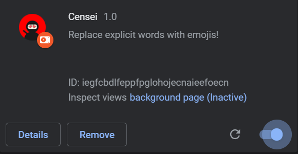
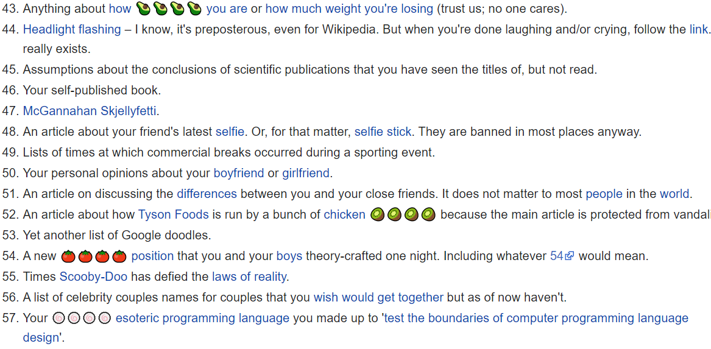
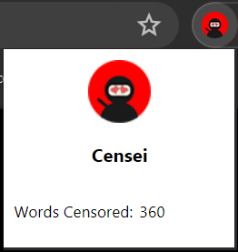

  
  <h3 align="center">Censei</h3>
  
Often times we wonder how to protect our children from the world of internet.
     
    We want our children to be able to gain knowledge from the internet but are afraid that they might come across some eplicit content.
     
     
    <strong>Introducing Censei</strong>
     
     
    Censei is a simple chrome extension that replaces explicit content in webpages with emojis. 
     
    No matter where your child is on the internet, Censei will censor those unwanted words for you.
     
    Check out the project details below in order to learn how Censei works, and get started right away!
     
     
    <a href="https://github.com/MLH-Fellowship/Censei/issues">Report Bug</a>
        ·
        <a href="https://github.com/MLH-Fellowship/Censei/issues">Submit Feature</a>
     
     
    </img>
    </img>
    </img>
    </img>
  

## How it Works

Censei works in the background of chrome, and gathers the entire html of the webpage that the user is on. Each individual html element is sent to the backend that checks for profanity or explicit words and replaces them with emojis. The resulting censored text is sent back to the chrome extension which then replaces it on the user's screen.

## Getting Started

The process of getting started is twofold, and is described below.

#### Cloning The Repo

1. Make sure you have git installed on your computer.
2. Run the following command to clone the repo: `git clone https://github.com/MLH-Fellowship/Censei.git`

#### Firing Up The Backend Server

1. Browse into the `censei-backend` folder.
2. Make sure you have python3 and pip installed.
3. Install dependencies using the following command:
   `pip install -r requirements.txt` OR `pip3 install -r requirements.txt`
4. Run the following command to start the server: `python main.py` OR `python3 main.py`

#### Installing Chrome Extension

1. Enter the following url in chrome `chrome://extensions`
2. Make sure Developer Mode is toggled on (top right) and click on "Load unpacked"
3. Select the `censei-frontend` folder and chrome should install the extension for you.

## Contributing

We would absolutely love for you to help us in making Censei better by contributing to our project. Head to the [Contributors](https://github.com/MLH-Fellowship/Censei/blob/master/CONTRIBUTORS.md) page to get started right away!

## Code of Conduct

We promote an open and a welcoming environment in this community. We pledge to making participation in our project and our community a harassment-free experience for everyone, regardless of age, body size, disability, ethnicity, sex characteristics, gender identity and expression, level of experience, education, socio-economic status, nationality, personal appearance, race, religion, or sexual identity and orientation.
Learn more about our [Code of Conduct](https://github.com/MLH-Fellowship/Censei/blob/master/CODE-OF-CONDUCT.md).

## Screenshots

</img>
 
</img>
 
</img>
 
</img>

## Tech Stack

</img>
 
</img>
 

## License

[MIT @ MLH Fellowship 2020](https://github.com/MLH-Fellowship/Censei/blob/master/LICENSE)

Made with ❤ by [Ahad Zai](https://github.com/ahadkhan98), [Ajwad Shaikh](https://github.com/ajwad-shaikh), and [Emily Amspoker](https://github.com/eamspoker) during MLH Fellowship Explorer Sprint 5 (Fall 2020)
